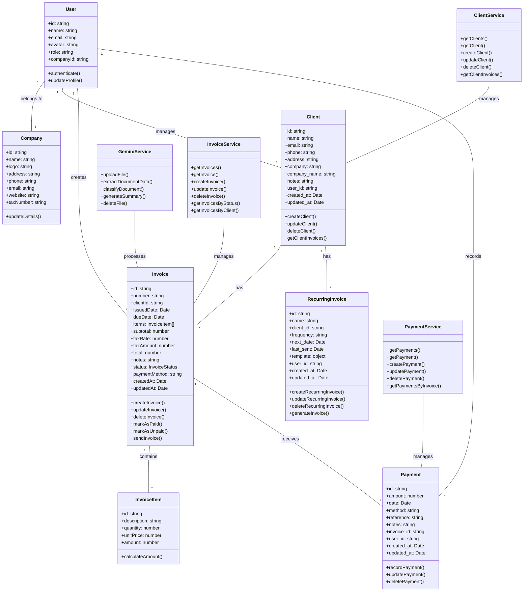
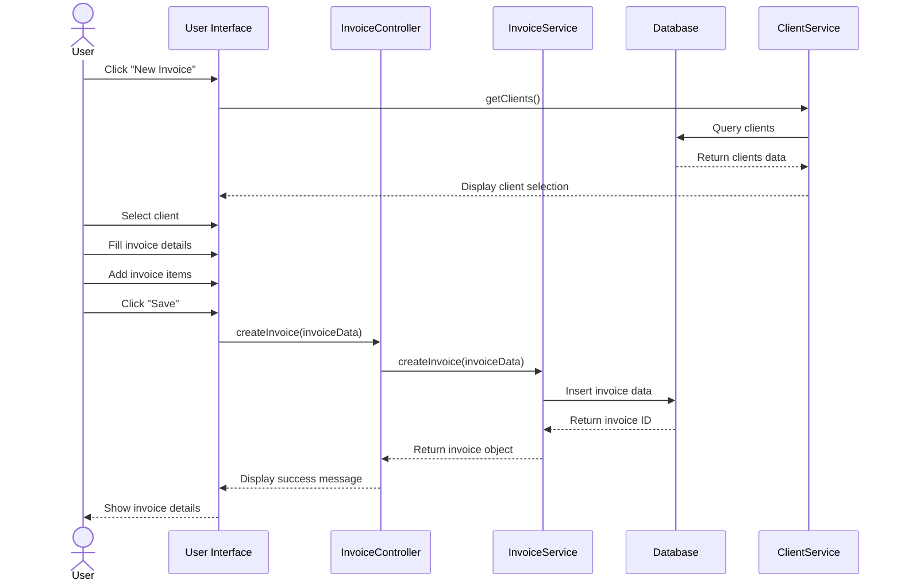
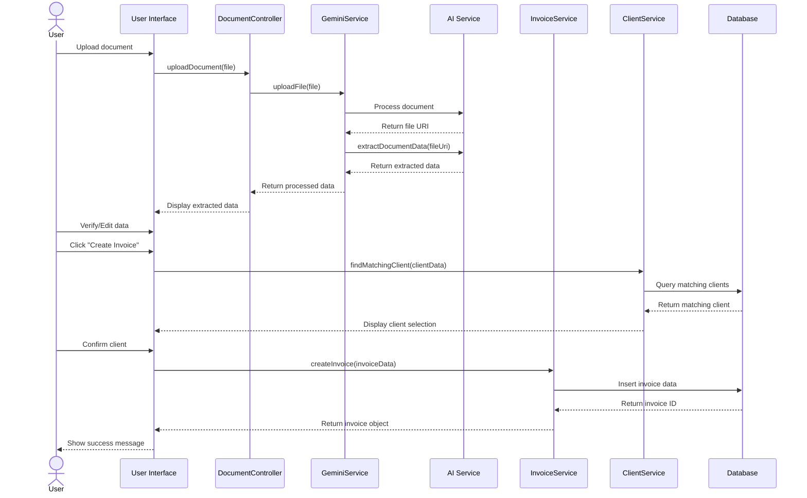
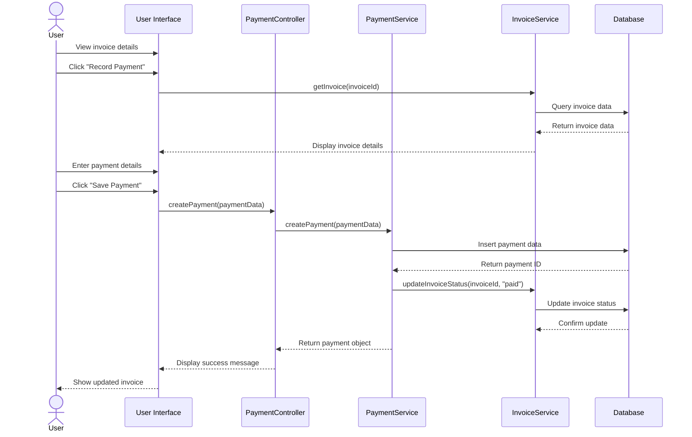

# I-Invoyisi: Class and Sequence Diagrams

This document provides the class diagrams and sequence diagrams for the I-Invoyisi application, illustrating the structure and interactions between different components of the system.

## Class Diagram

The class diagram below represents the main entities and their relationships in the I-Invoyisi application:

## Sequence Diagrams

### 1. Invoice Creation Process

This sequence diagram illustrates the process of creating a new invoice:

### 2. Document Processing Workflow

This sequence diagram shows the AI-powered document processing workflow:

### 3. Payment Recording Process

This sequence diagram illustrates the process of recording a payment for an invoice:

These diagrams provide a high-level overview of the system's structure and key interactions. They can be used as a reference for understanding the application architecture and workflow.
