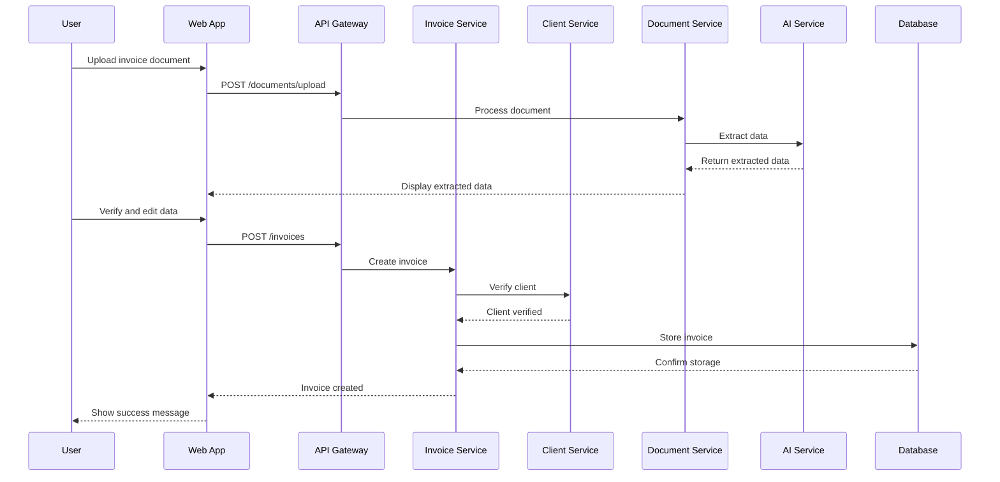
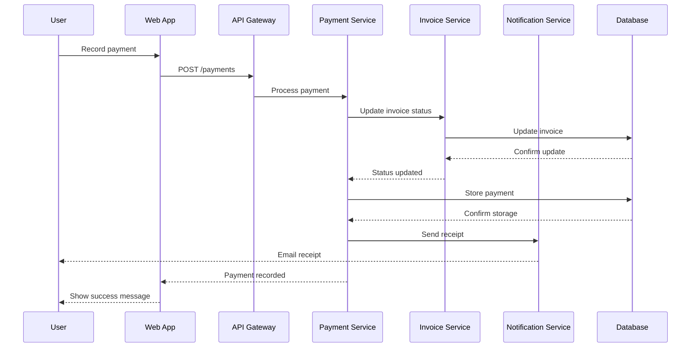

# I-Invoyisi: System Design and Architecture

## 1. System Overview

I-Invoyisi is an AI-powered invoice management system designed to streamline financial operations for businesses. This document outlines the comprehensive architecture using a modular approach combined with divide-and-conquer strategy to address the complexity of the system.

## 2. Design Approach

Our design follows two complementary strategies:

1. **Modular Approach**: The system is decomposed into distinct functional modules with well-defined interfaces, allowing for independent development, testing, and scaling.

2. **Divide-and-Conquer Strategy**: Complex problems are broken down into smaller, manageable sub-problems that can be solved independently and then combined to form the complete solution.

## 3. System Architecture Overview

```
┌─────────────────────────────────────────────────────────────────────────────┐
│                                                                             │
│                           CLIENT LAYER                                      │
│                                                                             │
│  ┌─────────────┐    ┌─────────────┐    ┌─────────────┐    ┌─────────────┐  │
│  │   Web App   │    │ Mobile App  │    │   Desktop   │    │    API      │  │
│  │  (React)    │    │(React Native)│   │    App      │    │   Clients   │  │
│  └──────┬──────┘    └──────┬──────┘    └──────┬──────┘    └──────┬──────┘  │
│         │                  │                  │                  │         │
└─────────┼──────────────────┼──────────────────┼──────────────────┼─────────┘
          │                  │                  │                  │
          │                  │                  │                  │
┌─────────┼──────────────────┼──────────────────┼──────────────────┼─────────┐
│         ▼                  ▼                  ▼                  ▼         │
│                                                                            │
│                           API GATEWAY LAYER                                │
│                                                                            │
│  ┌─────────────────────────────────────────────────────────────────────┐  │
│  │                         API Gateway                                  │  │
│  │                                                                      │  │
│  │  ┌─────────────┐    ┌─────────────┐    ┌─────────────┐              │  │
│  │  │ Rate Limiter │    │   Auth      │    │  Request    │              │  │
│  │  │              │    │  Service    │    │  Routing    │              │  │
│  │  └─────────────┘    └─────────────┘    └─────────────┘              │  │
│  └──────────────────────────────────┬──────────────────────────────────┘  │
│                                     │                                      │
└─────────────────────────────────────┼──────────────────────────────────────┘
                                      │
                                      │
┌─────────────────────────────────────┼──────────────────────────────────────┐
│                                     ▼                                      │
│                                                                            │
│                         SERVICE LAYER                                      │
│                                                                            │
│  ┌─────────────┐    ┌─────────────┐    ┌─────────────┐    ┌─────────────┐ │
│  │   Invoice   │    │   Client    │    │   Payment   │    │  Document   │ │
│  │   Service   │    │   Service   │    │   Service   │    │  Service    │ │
│  └──────┬──────┘    └──────┬──────┘    └──────┬──────┘    └──────┬──────┘ │
│         │                  │                  │                  │        │
│  ┌──────┴──────┐    ┌──────┴──────┐    ┌──────┴──────┐    ┌──────┴──────┐ │
│  │ Notification│    │ Dashboard   │    │ Reporting   │    │    AI       │ │
│  │   Service   │    │   Service   │    │   Service   │    │   Service   │ │
│  └──────┬──────┘    └──────┬──────┘    └──────┬──────┘    └──────┬──────┘ │
│         │                  │                  │                  │        │
└─────────┼──────────────────┼──────────────────┼──────────────────┼────────┘
          │                  │                  │                  │
          │                  │                  │                  │
┌─────────┼──────────────────┼──────────────────┼──────────────────┼────────┐
│         ▼                  ▼                  ▼                  ▼        │
│                                                                           │
│                         DATA LAYER                                        │
│                                                                           │
│  ┌─────────────┐    ┌─────────────┐    ┌─────────────┐    ┌─────────────┐│
│  │  Relational │    │   Cache     │    │   File      │    │   Search    ││
│  │  Database   │    │   Layer     │    │   Storage   │    │   Index     ││
│  │  (Supabase) │    │   (Redis)   │    │             │    │             ││
│  └─────────────┘    └─────────────┘    └─────────────┘    └─────────────┘│
│                                                                           │
└───────────────────────────────────────────────────────────────────────────┘
```

## 4. Module Decomposition

### 4.1 Client Layer

The client layer provides user interfaces for different platforms and devices.

#### 4.1.1 Web Application (React)
- **Responsibility**: Primary user interface for browser-based access
- **Key Components**:
  - Dashboard View
  - Invoice Management
  - Client Management
  - Document Processing
  - Reports and Analytics
- **Technologies**: React, TypeScript, Tailwind CSS

#### 4.1.2 Mobile Application (React Native)
- **Responsibility**: Mobile interface for on-the-go access
- **Key Components**:
  - Simplified Dashboard
  - Invoice Viewing and Approval
  - Payment Recording
  - Document Capture
- **Technologies**: React Native, TypeScript

#### 4.1.3 Desktop Application
- **Responsibility**: Offline-capable desktop interface
- **Key Components**:
  - Full System Access
  - Local Data Synchronization
  - Batch Processing
- **Technologies**: Electron, React

#### 4.1.4 API Clients
- **Responsibility**: Programmatic access for third-party integrations
- **Key Components**:
  - SDK Libraries
  - API Documentation
  - Authentication Helpers
- **Technologies**: REST, GraphQL

### 4.2 API Gateway Layer

The API gateway layer manages all incoming requests, providing a unified entry point to the system.

#### 4.2.1 API Gateway
- **Responsibility**: Route and manage API requests
- **Key Components**:
  - Request Routing
  - Load Balancing
  - API Versioning
  - Response Transformation
- **Technologies**: Express.js, Node.js

#### 4.2.2 Authentication Service
- **Responsibility**: Verify user identity and permissions
- **Key Components**:
  - JWT Token Management
  - OAuth Integration
  - Role-Based Access Control
  - Session Management
- **Technologies**: Supabase Auth, JWT

#### 4.2.3 Rate Limiter
- **Responsibility**: Prevent API abuse
- **Key Components**:
  - Request Counting
  - Throttling Rules
  - Client Identification
- **Technologies**: Redis, Token Bucket Algorithm

### 4.3 Service Layer

The service layer contains the core business logic of the application, divided into domain-specific microservices.

#### 4.3.1 Invoice Service
- **Responsibility**: Manage invoice lifecycle
- **Key Components**:
  - Invoice Creation
  - Status Management
  - Validation Logic
  - Recurring Invoices
- **Technologies**: Node.js, Express

#### 4.3.2 Client Service
- **Responsibility**: Manage client information
- **Key Components**:
  - Client CRUD Operations
  - Client Relationship Management
  - Contact Information Validation
- **Technologies**: Node.js, Express

#### 4.3.3 Payment Service
- **Responsibility**: Handle payment processing and recording
- **Key Components**:
  - Payment Recording
  - Payment Verification
  - Invoice Status Updates
  - Payment History
- **Technologies**: Node.js, Express

#### 4.3.4 Document Service
- **Responsibility**: Process and manage documents
- **Key Components**:
  - Document Upload
  - Storage Management
  - Format Conversion
  - Document Classification
- **Technologies**: Node.js, Express, Multer

#### 4.3.5 AI Service
- **Responsibility**: Provide AI capabilities
- **Key Components**:
  - Document Data Extraction
  - Text Analysis
  - Client Matching
  - Summary Generation
- **Technologies**: Google Gemini API, Node.js

#### 4.3.6 Notification Service
- **Responsibility**: Manage system notifications
- **Key Components**:
  - Email Notifications
  - In-App Notifications
  - Scheduled Reminders
  - Notification Templates
- **Technologies**: Node.js, Nodemailer

#### 4.3.7 Dashboard Service
- **Responsibility**: Aggregate data for dashboard views
- **Key Components**:
  - Financial Metrics Calculation
  - Data Aggregation
  - Time-Series Analysis
- **Technologies**: Node.js, Express

#### 4.3.8 Reporting Service
- **Responsibility**: Generate business reports
- **Key Components**:
  - Report Templates
  - Data Export
  - Scheduled Reports
  - Custom Report Builder
- **Technologies**: Node.js, PDFKit

### 4.4 Data Layer

The data layer manages persistent storage and retrieval of application data.

#### 4.4.1 Relational Database
- **Responsibility**: Primary data storage
- **Key Components**:
  - User Data
  - Invoice Data
  - Client Data
  - Payment Records
- **Technologies**: PostgreSQL (via Supabase)

#### 4.4.2 Cache Layer
- **Responsibility**: Improve data access performance
- **Key Components**:
  - Frequently Accessed Data
  - Session Data
  - API Response Caching
- **Technologies**: Redis

#### 4.4.3 File Storage
- **Responsibility**: Store documents and files
- **Key Components**:
  - Document Storage
  - File Versioning
  - Access Control
- **Technologies**: Supabase Storage

#### 4.4.4 Search Index
- **Responsibility**: Enable fast search capabilities
- **Key Components**:
  - Full-Text Search
  - Faceted Search
  - Search Suggestions
- **Technologies**: Elasticsearch

## 5. Data Flow and Key Interactions

### 5.1 Invoice Creation Flow



### 5.2 Payment Recording Flow



## 6. Scalability and Performance Considerations

### 6.1 Horizontal Scaling

Each service in the Service Layer can be independently scaled horizontally based on demand:

- **High-Traffic Services**: Invoice Service, Client Service
- **Compute-Intensive Services**: AI Service, Reporting Service
- **Scaling Strategy**: Auto-scaling based on CPU utilization and request queue length

### 6.2 Database Scaling

- **Read Replicas**: For high-read operations (dashboard, reporting)
- **Sharding**: Client and invoice data can be sharded by user_id
- **Connection Pooling**: Optimize database connection management

### 6.3 Caching Strategy

- **Application Cache**: Redis for frequently accessed data
- **API Response Caching**: Cache common API responses with appropriate TTL
- **Database Query Caching**: Cache expensive query results

### 6.4 Performance Optimizations

- **Lazy Loading**: Load data only when needed
- **Pagination**: Implement for large data sets
- **Asynchronous Processing**: Use message queues for non-critical operations
- **CDN**: Serve static assets through CDN

## 7. Security Measures

### 7.1 Authentication and Authorization

- **JWT-Based Authentication**: Secure, stateless authentication
- **Role-Based Access Control**: Fine-grained permission management
- **OAuth Integration**: Support for third-party authentication

### 7.2 Data Protection

- **Encryption at Rest**: All sensitive data encrypted in the database
- **Encryption in Transit**: HTTPS/TLS for all communications
- **Data Masking**: Sensitive data masked in logs and non-production environments

### 7.3 API Security

- **Rate Limiting**: Prevent abuse and DoS attacks
- **Input Validation**: Strict validation of all input data
- **CORS Policies**: Restrict cross-origin requests
- **API Keys**: Secure API access for third-party integrations

## 8. Fault Tolerance and Reliability

### 8.1 Error Handling

- **Graceful Degradation**: System continues to function with reduced capabilities during partial failures
- **Circuit Breakers**: Prevent cascading failures
- **Retry Mechanisms**: Automatic retries with exponential backoff for transient failures

### 8.2 Data Redundancy

- **Database Backups**: Regular automated backups
- **Replication**: Data replicated across multiple availability zones
- **Point-in-Time Recovery**: Ability to restore to any point in time

### 8.3 Monitoring and Alerting

- **Health Checks**: Regular service health monitoring
- **Performance Metrics**: Track key performance indicators
- **Anomaly Detection**: Identify unusual patterns that may indicate issues
- **Alerting System**: Notify appropriate personnel of critical issues

## 9. Deployment Architecture

### 9.1 Development Environment

- **Local Development**: Docker containers for consistent development environment
- **CI/CD Pipeline**: Automated testing and deployment
- **Feature Flags**: Control feature rollout

### 9.2 Production Environment

- **Containerization**: Docker for service deployment
- **Orchestration**: Kubernetes for container management
- **Load Balancing**: Distribute traffic across service instances
- **Auto-Scaling**: Automatically adjust resources based on demand

## 10. Future Enhancements

- **Real-Time Updates**: WebSocket integration for live data updates
- **Advanced Analytics**: Machine learning for financial insights and predictions
- **Mobile App Enhancements**: Offline mode and document scanning improvements
- **Integration Ecosystem**: Expand third-party integrations (accounting software, CRM systems)
- **Internationalization**: Support for multiple languages and currencies
