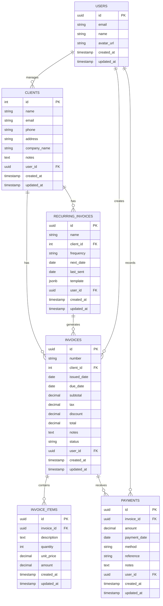

# I-Invoyisi: Database Schema Design

## Overview

This document details the database schema design for the I-Invoyisi application. The schema is implemented in PostgreSQL via Supabase and follows relational database design principles with appropriate normalization.

## Entity Relationship Diagram

## Table Definitions

### USERS

Stores user account information and authentication details.

| Column | Type | Constraints | Description |
|--------|------|-------------|-------------|
| id | UUID | PRIMARY KEY | Unique identifier for the user |
| email | VARCHAR(255) | NOT NULL, UNIQUE | User's email address |
| name | VARCHAR(255) | NOT NULL | User's full name |
| avatar_url | VARCHAR(255) | | URL to user's profile image |
| created_at | TIMESTAMP | NOT NULL, DEFAULT NOW() | Record creation timestamp |
| updated_at | TIMESTAMP | NOT NULL, DEFAULT NOW() | Record update timestamp |

### CLIENTS

Stores client information and contact details.

| Column | Type | Constraints | Description |
|--------|------|-------------|-------------|
| id | INTEGER | PRIMARY KEY, AUTO INCREMENT | Unique identifier for the client |
| name | VARCHAR(255) | NOT NULL | Client's name |
| email | VARCHAR(255) | | Client's email address |
| phone | VARCHAR(50) | | Client's phone number |
| address | TEXT | | Client's physical address |
| company_name | VARCHAR(255) | | Client's company name |
| notes | TEXT | | Additional notes about the client |
| user_id | UUID | NOT NULL, FOREIGN KEY | Reference to the user who manages this client |
| created_at | TIMESTAMP | NOT NULL, DEFAULT NOW() | Record creation timestamp |
| updated_at | TIMESTAMP | NOT NULL, DEFAULT NOW() | Record update timestamp |

### INVOICES

Stores invoice metadata and status information.

| Column | Type | Constraints | Description |
|--------|------|-------------|-------------|
| id | UUID | PRIMARY KEY | Unique identifier for the invoice |
| number | VARCHAR(50) | NOT NULL | Invoice number (user-facing identifier) |
| client_id | INTEGER | NOT NULL, FOREIGN KEY | Reference to the client |
| issued_date | DATE | NOT NULL | Date the invoice was issued |
| due_date | DATE | NOT NULL | Date the invoice is due |
| subtotal | DECIMAL(10,2) | NOT NULL | Sum of all line items before tax |
| tax | DECIMAL(10,2) | NOT NULL, DEFAULT 0 | Tax amount |
| discount | DECIMAL(10,2) | NOT NULL, DEFAULT 0 | Discount amount |
| total | DECIMAL(10,2) | NOT NULL | Final invoice amount |
| notes | TEXT | | Additional notes for the invoice |
| status | VARCHAR(20) | NOT NULL | Status of the invoice (draft, unpaid, paid, overdue) |
| user_id | UUID | NOT NULL, FOREIGN KEY | Reference to the user who created the invoice |
| created_at | TIMESTAMP | NOT NULL, DEFAULT NOW() | Record creation timestamp |
| updated_at | TIMESTAMP | NOT NULL, DEFAULT NOW() | Record update timestamp |

### INVOICE_ITEMS

Stores line items for each invoice.

| Column | Type | Constraints | Description |
|--------|------|-------------|-------------|
| id | UUID | PRIMARY KEY | Unique identifier for the invoice item |
| invoice_id | UUID | NOT NULL, FOREIGN KEY | Reference to the parent invoice |
| description | TEXT | NOT NULL | Description of the item |
| quantity | INTEGER | NOT NULL | Quantity of the item |
| unit_price | DECIMAL(10,2) | NOT NULL | Price per unit |
| amount | DECIMAL(10,2) | NOT NULL | Total amount (quantity * unit_price) |
| created_at | TIMESTAMP | NOT NULL, DEFAULT NOW() | Record creation timestamp |
| updated_at | TIMESTAMP | NOT NULL, DEFAULT NOW() | Record update timestamp |

### PAYMENTS

Stores payment records and transaction details.

| Column | Type | Constraints | Description |
|--------|------|-------------|-------------|
| id | UUID | PRIMARY KEY | Unique identifier for the payment |
| invoice_id | UUID | NOT NULL, FOREIGN KEY | Reference to the invoice being paid |
| amount | DECIMAL(10,2) | NOT NULL | Payment amount |
| payment_date | DATE | NOT NULL | Date the payment was made |
| method | VARCHAR(50) | NOT NULL | Payment method (cash, credit card, bank transfer, etc.) |
| reference | VARCHAR(100) | | Reference number or transaction ID |
| notes | TEXT | | Additional notes about the payment |
| user_id | UUID | NOT NULL, FOREIGN KEY | Reference to the user who recorded the payment |
| created_at | TIMESTAMP | NOT NULL, DEFAULT NOW() | Record creation timestamp |
| updated_at | TIMESTAMP | NOT NULL, DEFAULT NOW() | Record update timestamp |

### RECURRING_INVOICES

Stores templates for recurring invoices.

| Column | Type | Constraints | Description |
|--------|------|-------------|-------------|
| id | UUID | PRIMARY KEY | Unique identifier for the recurring invoice |
| name | VARCHAR(255) | NOT NULL | Name of the recurring invoice template |
| client_id | INTEGER | NOT NULL, FOREIGN KEY | Reference to the client |
| frequency | VARCHAR(20) | NOT NULL | Frequency of recurrence (weekly, monthly, quarterly, yearly) |
| next_date | DATE | NOT NULL | Next date to generate an invoice |
| last_sent | DATE | | Date when the last invoice was generated |
| template | JSONB | NOT NULL | Template data for generating invoices |
| user_id | UUID | NOT NULL, FOREIGN KEY | Reference to the user who created the template |
| created_at | TIMESTAMP | NOT NULL, DEFAULT NOW() | Record creation timestamp |
| updated_at | TIMESTAMP | NOT NULL, DEFAULT NOW() | Record update timestamp |

## Indexes

To optimize query performance, the following indexes are implemented:

1. **clients_user_id_idx**: Index on `clients.user_id` to speed up queries filtering clients by user
2. **invoices_client_id_idx**: Index on `invoices.client_id` to speed up queries filtering invoices by client
3. **invoices_user_id_idx**: Index on `invoices.user_id` to speed up queries filtering invoices by user
4. **invoices_status_idx**: Index on `invoices.status` to speed up queries filtering invoices by status
5. **invoice_items_invoice_id_idx**: Index on `invoice_items.invoice_id` to speed up queries retrieving items for an invoice
6. **payments_invoice_id_idx**: Index on `payments.invoice_id` to speed up queries retrieving payments for an invoice
7. **payments_user_id_idx**: Index on `payments.user_id` to speed up queries filtering payments by user
8. **recurring_invoices_client_id_idx**: Index on `recurring_invoices.client_id` to speed up queries filtering recurring invoices by client
9. **recurring_invoices_user_id_idx**: Index on `recurring_invoices.user_id` to speed up queries filtering recurring invoices by user

## Data Integrity Constraints

1. **Foreign Key Constraints**: Ensure referential integrity between related tables
2. **NOT NULL Constraints**: Ensure required fields are always provided
3. **Default Values**: Provide sensible defaults for certain fields
4. **Check Constraints**:
   - `invoices_status_check`: Ensures invoice status is one of: 'draft', 'unpaid', 'paid', 'overdue'
   - `invoices_total_check`: Ensures invoice total is greater than or equal to zero
   - `invoice_items_quantity_check`: Ensures item quantity is greater than zero
   - `payments_amount_check`: Ensures payment amount is greater than zero

## Migration Strategy

Database migrations are managed through Supabase migrations, allowing for:

1. **Version Control**: All schema changes are tracked in version control
2. **Rollback Capability**: Ability to revert to previous schema versions if needed
3. **Collaborative Development**: Multiple developers can work on the schema simultaneously
4. **Environment Consistency**: Ensure development, staging, and production environments have consistent schemas

## Performance Considerations

1. **Denormalization**: Strategic denormalization for frequently accessed data (e.g., storing total in invoices table)
2. **Materialized Views**: For complex reporting queries that are expensive to compute
3. **Partitioning**: For large tables (e.g., invoices, payments) in high-volume deployments
4. **Query Optimization**: Regular review and optimization of slow queries
5. **Connection Pooling**: Efficient management of database connections
